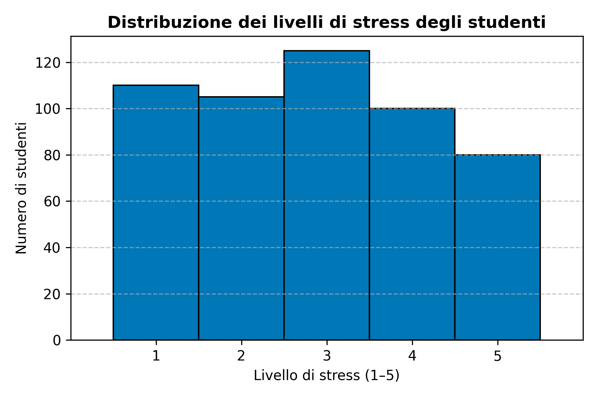
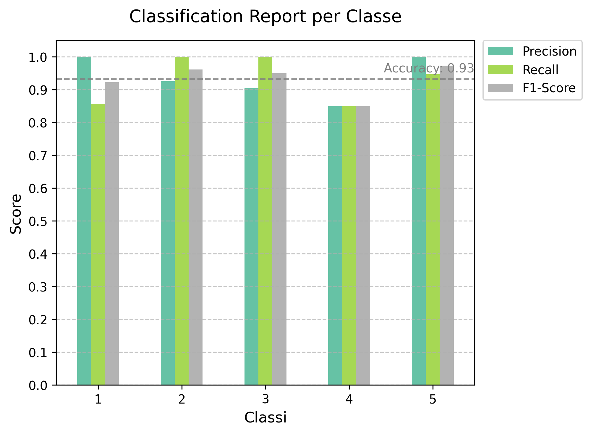
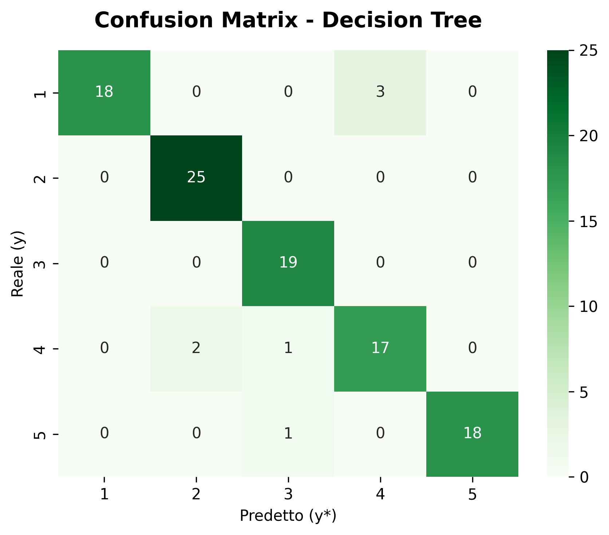

# 🧠 Student Stress Level Classifier

Questo progetto di Machine Learning classifica il livello di stress degli studenti (da 1 a 5)  
in base a variabili che descrivono abitudini, benessere e rendimento accademico.

### Feature del dataset:

- **Sleep quality** → qualità del sonno
- **Weeks headaches** → frequenza settimanale di mal di testa
- **Academic performance** → rendimento accademico percepito
- **Study load** → carico di studio complessivo
- **Extracurricular activities weekly** → numero di attività extracurricolari settimanali

La variabile target (**Student stress level**) rappresenta il livello di stress dello studente su una scala da **1 (basso)** a **5 (alto)**.

---

## 🎯 Obiettivi del progetto

- Creare una pipeline completa di Machine Learning
- Pulire e preprocessare i dati
- Allenare un modello Decision Tree
- Valutare le prestazioni tramite metriche e grafici
- Salvare automaticamente i risultati e il modello

---

## 📘 Dataset

- **Nome:** Student Stress Levels Dataset
- **Fonte:** [Kaggle – Student Stress Levels Dataset](https://www.kaggle.com/datasets/grandmaster07/student-stress-levels-dataset)
- **Autore:** grandmaster07
- **Licenza:** CC0 (Public Domain) ✅
- **File incluso:** `dataset.csv`

---

## ⚙️ Come eseguire il progetto

Per eseguire l’intera pipeline e ottenere i risultati finali, segui questi passaggi:

### 1 - (Facoltativo ma consigliato) — Crea un ambiente virtuale

Questo permette di installare le librerie solo per il progetto, senza modificare quelle del sistema.

```bash
python -m venv .venv
# Attiva l'ambiente
# Su Windows:
.venv\Scripts\activate
# Su macOS / Linux:
source .venv/bin/activate
```

### 2 - Installa le librerie necessarie

```
pip install -r requirement.txt
```

### 3 - Esegui la pipeline completa

```
python main.py
```

## 📊 Analisi e Preprocessing del Dataset

Il dataset originale (`dataset.csv`) è stato analizzato per verificare la qualità dei dati e prepararlo al training del modello.
Tutti i valori delle feature sono espressi su una scala da 1 a 5, e la variabile target è **“Student stress level”** (livello di stress percepito).

### 1 - Analisi inziale

**Fasi di preprocessing valutate**

Durante l’analisi, sono state valutate le operazioni di preprocessing più comuni nei progetti di Machine Learning, ma in questo caso **non sono state necessarie**:

- **Encoding:** tutte le variabili sono già numeriche (da 1 a 5), quindi non è richiesto alcun tipo di codifica aggiuntiva.
- **Normalizzazione / Scaling:** poiché tutte le feature condividono la stessa scala (1–5), una normalizzazione non avrebbe aggiunto informazioni utili.
- **Feature Selection:** il dataset contiene solo 5 feature principali, quindi rimuoverne alcune avrebbe ridotto eccessivamente la capacità informativa del modello.
- **Bilanciamento delle classi:** non è stata applicata alcuna tecnica di riequilibrio, poiché non sono emerse forti discrepanze nella distribuzione della variabile target “Student stress level”.

<p align="center">
  
</p>

<p align="center"><em>È risultato bilanciato, motivo per cui non è stata applicata alcuna tecnica di riequilibrio.</em></p>

Sono state invece eseguite le altre due operazioni di preprocessing, ovvero:

- **Pulizia dei dati**
- **Divisione in train/test**

### 2 - Pulizia dei dati

La funzione `clean_data()` in `data_cleaning.py`:

- rimuove le righe con valori mancanti (`NaN`)
- filtra eventuali valori fuori range (1–5)
- resetta gli indici dopo la rimozione

### 3 - Divisione in train/test

In `split_dataset.py` viene effettuata la divisione del dataset con la funzione di `sklearn.model_selection`:

```
train_test_split(df, test_size=0.2, random_state=42)
```

L’80% dei dati viene utilizzato per l’addestramento e il restante 20% per la valutazione, percentuali considerate uno standard di riferimento nella validazione dei modelli di Machine Learning.
Questa suddivisione consente di fornire al modello una quantità sufficiente di dati per apprendere in modo efficace, mantenendo al tempo stesso un insieme separato per testare la sua capacità di generalizzare su dati mai visti prima.

I due file generati vengono salvati in:

```
processed_data/train.csv
processed_data/test.csv
```

In questo modo, i dati puliti e separati possono essere riutilizzati anche in sessioni future senza dover ripetere la pulizia.

## 🤖 Training

Il modello scelto per l’addestramento è un **Decision Tree Classifier**, una tecnica di _supervised learning_ utilizzata per problemi di classificazione.
Questo modello è stato selezionato per la sua interpretabilità e per la capacità di gestire feature numeriche di piccola scala (da 1 a 5 nel nostro dataset), senza necessità di normalizzazione o scaling.

### 1 - Modello utilizzato

Il **Decision Tree Classifier** costruisce una struttura ad albero che suddivide progressivamente il dataset in sottoinsiemi più omogenei in base ai valori delle feature.
Ogni nodo dell’albero rappresenta una decisione basata su una variabile (feature), e ogni ramo una possibile risposta.
L’obiettivo è minimizzare l’impurità delle classi all’interno delle foglie, creando regole di decisione semplici e interpretabili.

### 2 - Come è stato allenato

L’addestramento è stato eseguito sul file `train.csv`, generato durante la fase di preprocessing.
Il dataset è stato suddiviso in 80% training e 20% test per valutare le performance in modo bilanciato.
Durante il training, il modello ha appreso le relazioni tra le feature (come sleep quality, study load, academic performance, ecc.) e il livello di stress dello studente.

L’allenamento è stato implementato nel file `train_model.py` utilizzando la libreria `scikit-learn`.

### 3 - Motivazione e funzionamento del modello

Il Decision Tree è stato scelto per tre motivi principali:

1. **Semplicità e interpretabilità**: ogni decisione può essere visualizzata e compresa facilmente.

2. **Adatto a dataset piccoli**: non richiede grandi quantità di dati né tuning complesso.

3. **Gestione di feature discrete**: funziona bene con valori categorici o numerici su scale limitate (1–5).

Durante la costruzione dell’albero, l’algoritmo seleziona la feature più informativa in base alla Gini Impurity, che misura quanto i sottoinsiemi risultanti siano “puri” (cioè contenenti campioni della stessa classe).

### 4 - Scelta degli iperparametri

Gli iperparametri principali impostati sono:

- `criterion="gini"` → per misurare l’impurità dei nodi.

- `max_depth=5` → per evitare overfitting, limitando la profondità dell’albero.

- `min_samples_split=2` → per consentire la creazione di nuovi nodi solo quando ci sono almeno due campioni.

- `random_state=42` → per garantire la riproducibilità dei risultati.

Questi valori sono stati scelti dopo test preliminari che hanno mostrato un buon equilibrio tra accuratezza e generalizzazione del modello sui dati di validazione.

## 📈 Testing / Results

Dopo la fase di addestramento, il modello è stato testato sul **20% dei dati rimanenti** (set di test), con l’obiettivo di valutare la capacità di generalizzare su esempi mai visti prima.

### 1 - Metriche di valutazione

Per misurare le prestazioni del modello sono state utilizzate le metriche di classificazione standard, calcolate tramite le funzioni di `scikit-learn`:

- **Accuracy** → indica la percentuale di previsioni corrette sul totale dei campioni.

$$
Accuracy = \frac{Previsioni\ corrette}{Totale\ dei\ campioni}
$$

- **Precision** → misura la capacità del modello di evitare falsi positivi, cioè quante delle istanze previste come appartenenti a una classe sono effettivamente corrette.

- **Recall** → valuta la capacità del modello di riconoscere tutti gli esempi appartenenti a una determinata classe (ridurre i falsi negativi).

- **F1-Score** → rappresenta la media armonica tra Precision e Recall. È utile quando le classi non sono perfettamente bilanciate.

### 2 - Analisi dei risultati

Il modello ha prodotto risultati coerenti e bilanciati tra le varie classi di stress, mostrando una buona capacità di generalizzare sui dati di test.

Le performance sono riassunte tramite il **Classification Report** e la **Confusion Matrix**, che permettono di analizzare in dettaglio i risultati per ogni livello di stress (da 1 a 5).

<div align="center">
  <div style="display: inline-block; text-align: left; width: 600px;">
    
    <p style="width: 600px; text-align: left; margin: 0 auto;">
      <em>Dal classification report è possibile osservare valori di precisione e recall simili tra le classi, segno che il modello non tende a favorirne una in particolare.</em>
    </p>
  </div>
</div>

<p align="center">
  
</p>

<p align="center"><em>La confusion matrix mostra che la maggior parte delle predizioni si concentra sulla diagonale principale, confermando una buona accuratezza complessiva e una bassa confusione tra i livelli di stress contigui.</em></p>
